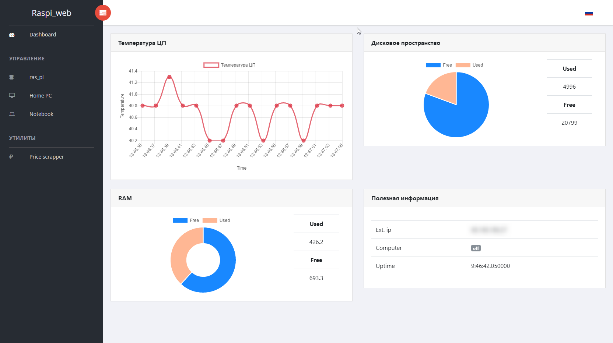
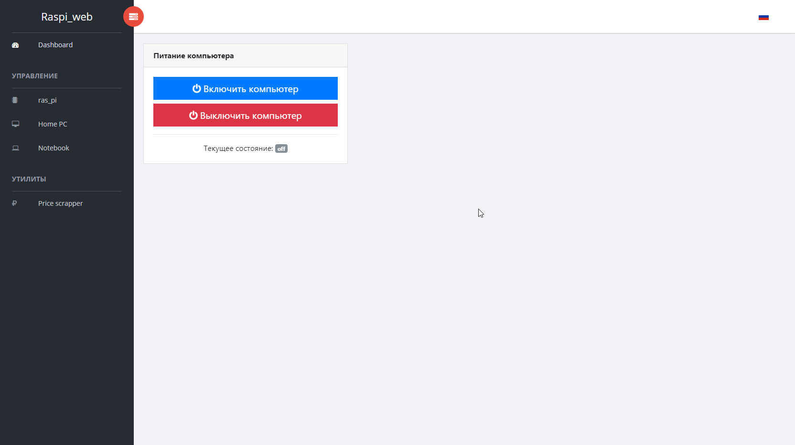
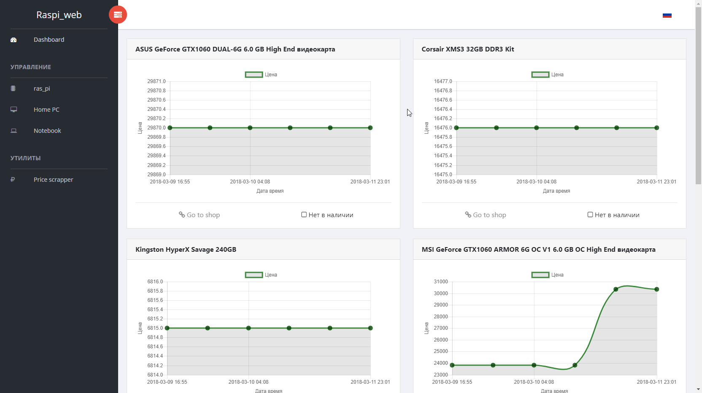

## Raspberry Pi Web Dashboard
Проект на основе [Sufee HTML5 Admin Dashboard Template](https://github.com/puikinsh/sufee-admin-dashboard) и Django 2.*. Представляет из себя панель управления "малинкой" и другими устройствами в сети.  
Для мониторинга состояния различных компонентов использована библиотека [psutils](https://pypi.python.org/pypi/psutil) ([документация](http://psutil.readthedocs.io/))  
Статика подключена вот [этим сопсобом](https://catexis.wordpress.com/2018/02/22/static-in-%D0%B2-django/).  

## Screenshots
  
  
  

## History
### 12.03.2018
За прошедшие выходные была проделана большая работа
*  На главной странице доделаны графики
*  На главной странице добавлена возможность отображения статуса компьютера
*  Добавлена страница по управлению питанием компьютера
*  Написана программа для управления питанием компьютера, на ОС Windows (ЯП C#)
*  Реализовано отображение графиков на странце "веб-паучка"
*  Добавлены скриншоты на страницу github программы
***
### 24.02.2018
*  Начал проработку обновления графиков
***
### 23.02.2018
*  На главную страницу добавлены графики
*  Написана функция передачи данных в контекст страницы в виде JSON
***
### 22.02.2018
*  Запущена тестовая страница
*  Определён базовый шаблон
*  Добавлен файл requirements.txt
***
